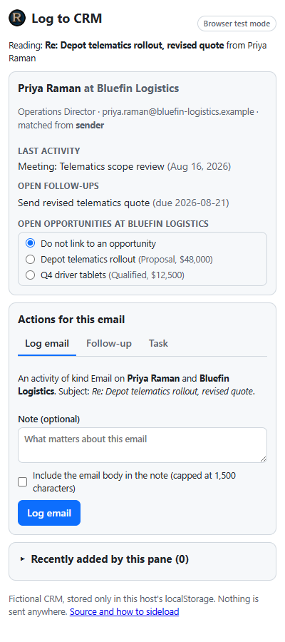

# Log to CRM: an Outlook add-in you can sideload from this page

[](LICENSE)
[](https://github.com/NUIAZ/outlook-crm-addin/actions/workflows/test.yml)

Open an email in Outlook, click **Log to CRM**, and a taskpane looks the sender up
in the CRM, shows you who they are and what is going on with them, and lets you log
the email as an activity, set a follow-up, or create a task against the right contact,
company and opportunity. Writing a reply? The same button appears on the draft and
matches the recipients instead.

This is the public rebuild of an internal add-in. The architecture is the same; the
CRM behind it is now a small fictional dataset that lives inside the pane, which is
what makes two things possible:

1. **You can sideload the manifest into your own Outlook right now**, from this
   repository's GitHub Pages site, with no server and no account. Office add-ins only
   need an HTTPS source; Pages is HTTPS.
2. **The same page is the demo.** Open it in a browser and the pane falls into test
   mode: describe an email, and everything below behaves exactly as it would in
   Outlook. No Outlook required to see the whole thing work.

<p align="center">
  
</p>

**Live:** <https://nuiaz.github.io/outlook-crm-addin/> (browser demo)
· **Manifest:** <https://nuiaz.github.io/outlook-crm-addin/manifest.xml>

---

## Try it in your Outlook (two minutes)

1. Open **Outlook on the web** (outlook.office.com or outlook.live.com) or the new
   Outlook for Windows or Mac.
2. Go to <https://aka.ms/olksideload>. That opens **Add-ins for Outlook** at
   *My add-ins*. (Or: gear icon, *Manage add-ins*; in classic Outlook, File, *Manage
   Add-ins*, which opens the same page.)
3. Under **Custom Addins**, choose **Add a custom add-in**, then **Add from URL**, and
   paste:
   ```
   https://nuiaz.github.io/outlook-crm-addin/manifest.xml
   ```
   (or **Add from file** with a downloaded copy of
   [`public/manifest.xml`](public/manifest.xml)). Confirm the warning; this is what
   sideloading a custom add-in always says.
4. Open any received email. A **Log to CRM** button appears on the message (on the
   ribbon, or under the **…** / Apps menu depending on the client). Click it.
5. Open a draft or a reply: the same button is there, and the pane matches the
   people you are writing to.

To see a match, use one of the fictional addresses in the pane's sample data, for
example forward yourself an email and change nothing: the pane will tell you the
sender is not in the CRM and offer to create them. Or open the browser demo and pick
**Known sender** from the sample list to see the full context card.

Classic Outlook for Windows picks the add-in up after you sideload it on the web.
If *Add a custom add-in* is missing, your organisation has disabled user sideloading;
the browser demo shows the same pane. To remove it: same page, **…** next to the
add-in, **Remove**.

### Where does the data I add go?

Nowhere but your own machine. Everything you add in the pane (a logged email, a
follow-up, a task, a new contact) is written to `localStorage` inside whichever host
is showing the pane, under one key. No network request is made; there is no server.
That gives the demo real persistence (log the same email twice and the duplicate
warning fires), with three honest limits: it is **per device and per host** (Outlook
desktop, Outlook on the web, and a browser tab each have their own copy), **clearing
site data removes it**, and **nobody else can see it**. The pane has a **Reset demo
data** button, and an **Export** that shows the exact JSON the real add-in would have
POSTed to the CRM API, so the transport boundary is visible rather than hidden.

In the internal version, `src/crm/store.ts` was a thin HTTP client with the same
function names; every other file was the same.

---

## What it does

- **Matches the right person.** In read mode: the sender first, then To, then CC.
  That order catches the common case where an assistant sends and the real buyer is
  CC'd. In compose mode there is no sender worth matching (it is you), so recipients
  are matched in To, CC order. Your own address is skipped.
- **Shows context before you act.** The contact's last activity, your open follow-ups
  for them, and their company's open opportunities. Pick an opportunity to link the
  action to it. If several people on the email matched, switch between them.
- **Three actions.** *Log email* creates an Activity (with an optional note and
  opt-in, capped body capture). *Follow-up* creates a reminder on an admin-managed
  timeframe. *Task* creates a to-do with the subject prefilled and an optional date.
  All three link contact, company and the chosen opportunity.
- **Warns on duplicates, never blocks.** Every record carries the email's RFC
  Message-ID. Log the same email again and the pane says what already exists and
  changes the button to *Log anyway*. The software can notice; it does not know
  whether you meant to log one thread against two deals. Warning is always right.
- **Creates contacts in place.** Unknown sender? The pane pre-fills first and last
  name from the display name (or the address), and if the domain belongs to a known
  company, pre-selects it: the most common real case is a new person at an existing
  customer.
- **Follows you between emails.** The pane supports pinning and listens for the
  host's ItemChanged event, re-reading the item each time.
- **Runs without Outlook.** `Office.onReady()` reports no host in a browser, so the
  pane shows a test-mode bar instead: pick a sample email or type your own, in read or
  compose mode. Everything below the bar is the same code.

## How it works

The pane is a small React app with one seam to Office.js. `src/office/host.ts` is the
only file that touches `Office`: it detects the host (with a timeout, so a slow CDN
cannot hang the pane), reads the open item, normalises read mode's plain values and
compose mode's async getters into one `EmailContext`, fetches the body only on demand,
and subscribes to ItemChanged. Everything else works from that `EmailContext`, which
in a browser comes from the test-mode form instead.

`src/crm/match.ts` decides who on the email is in the CRM, in the order above, and
falls back to a domain guess when nobody matches. `src/crm/actions.ts` builds the
Activity, FollowUp and Task records and runs the duplicate check. Both are pure
functions with no DOM and no Office, which is where most of the tests live.
`src/crm/store.ts` holds the dataset, persists it, and notifies React through
`useSyncExternalStore`. The components are thin: a context card, the three action
forms, the create-contact form, the test-mode bar, and a "recently added / export /
reset" drawer at the bottom that shows where the data went.

The manifest (`public/manifest.xml`) declares both the read and compose command
surfaces and points every URL at the Pages origin. A test checks that every URL is
HTTPS and on that origin and that every icon it names actually shipped, because
Exchange rejects manifests for exactly those reasons and only tells you at sideload
time.

## What is different from the internal version, honestly

- **No backend, no auth.** The real pane signed in with the CRM's cookie flow inside
  the Outlook webview and refreshed silently; the store was an HTTP client. Here the
  store is localStorage and there is nothing to sign in to.
- **No server-side validation.** The real create-contact form ran the same
  validation and duplicate rules as the CRM's web app. Here the duplicate-address
  check is local and the rest is the browser's required-field handling.
- **The connectivity gate is a pass-through by default.** The internal CRM lived on
  the office network, so the pane probed it first and showed a "connect to VPN, then
  retry" screen with automatic re-checks. That code is still here
  (`src/office/ConnectivityGate.tsx`) and turns on if you set
  `VITE_BACKEND_PROBE_URL` at build time; it is off because the demo has nothing to
  probe.
- **The dataset is fictional.** Six companies, eighteen people, `.example` domains
  (reserved, so nothing can ever route). Reset restores it.

## Security, in short

Sideloading any mail add-in means its pane can read the message you have open (and,
when pinned, each one you open after). This one sends nothing anywhere: no network
calls, data stays in the host's localStorage, body capture is opt-in and capped. The
manifest asks for `ReadItem` only and points every URL at this repository's Pages
origin (a test enforces it). There is no `innerHTML` anywhere; email content is
rendered as text. The single external script is Office.js from Microsoft's CDN, which
is required, and a Content Security Policy in `index.html` allows that host and
nothing else off-origin. What the real add-in had to add (cookie auth in the webview,
server-side validation and authorisation, HTTPS with a trusted certificate) is listed
in [SECURITY.md](SECURITY.md).

**After you sideload:** if the pane shows blank inside Outlook while the browser demo
works, the CSP is the first suspect (Office.js occasionally adds a resource host);
see SECURITY.md.

## Run it locally

```bash
npm install
npm run dev       # http://localhost:5173, browser test mode
npm test          # 56 tests: matching, actions, store, the Office seam via a stub,
                  # the pane end to end in both hosts, and the manifest
npm run build     # dist/, what Pages serves
```

To sideload a local build you need HTTPS (Outlook refuses plain http except for
localhost in some clients) and a manifest whose URLs point at your host; the Pages
URLs in `public/manifest.xml` are the easy path.

## Layout

```
public/manifest.xml        the Office manifest, served from Pages for "add from URL"
public/icons/              toolbar and store icons
index.html                 the taskpane page; loads office.js from Microsoft's CDN first
src/App.tsx                host detection, item reading, match, render
src/office/host.ts         the only file that talks to Office.js
src/office/office.d.ts     hand-written types for the slice of Office.js used
src/office/ConnectivityGate.tsx   "is the backend reachable" gate (off by default)
src/crm/types.ts           Company, Contact, Opportunity, Activity, FollowUp, Task
src/crm/seed.ts            the fictional dataset and the sample emails
src/crm/match.ts           who on this email is in the CRM (pure)
src/crm/actions.ts         build records, duplicate check, body capture (pure)
src/crm/store.ts           localStorage-backed store, observable
src/components/            ContextCard, ActionForms, CreateContact, TestModeBar, RecentAndExport
tests/                     vitest + testing-library; tests/office-stub.ts fakes Office
docs/                      screenshots; scripts/screenshots.mjs regenerates them
```

## License

MIT
